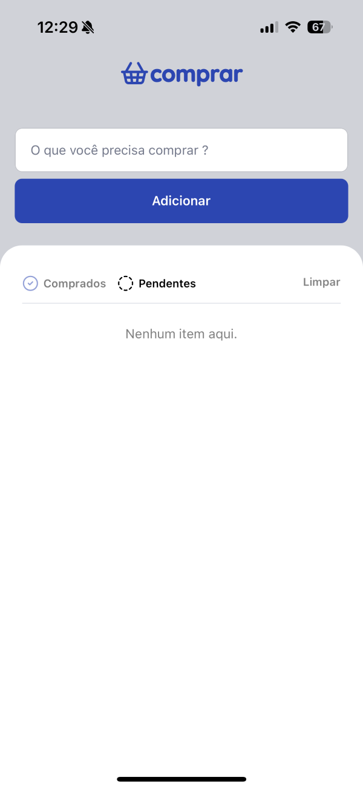
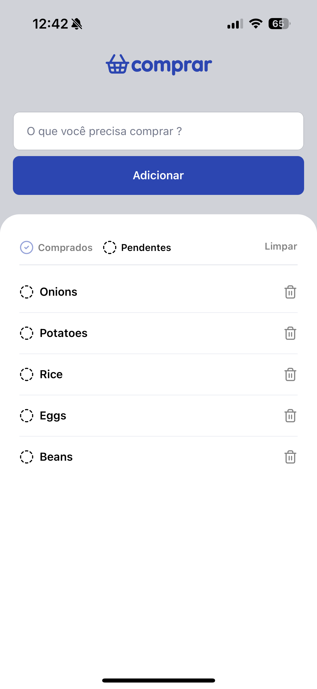
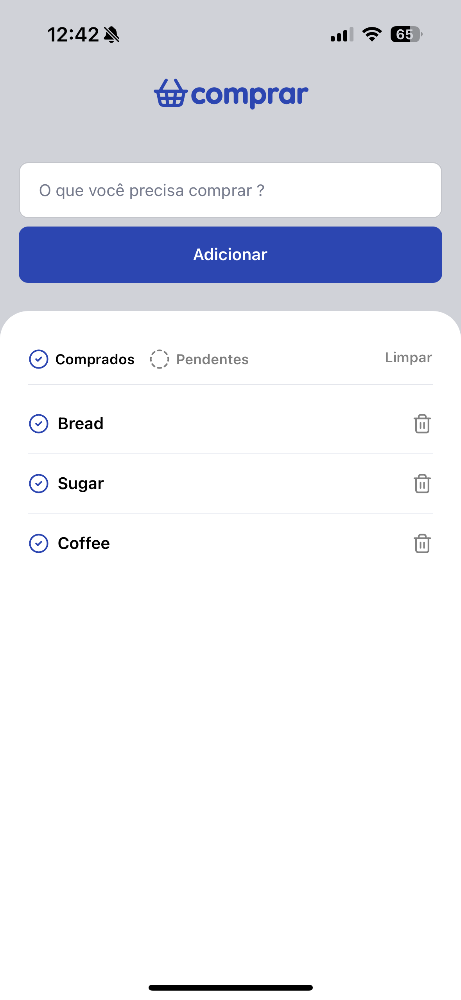

# 🛍️ Comprar - Shopping list

A minimalist shopping list app built with React Native and Expo, helping you keep track of your shopping items with ease.



## ✨ Features

- **Intuitive Item Management**
  - Add new shopping items
  - Mark items as done/pending
  - Remove individual items
  - Clear entire list

- **Smart Organization**
  - Filter items by status (Done/Pending)
  - Persistent storage using AsyncStorage
  - Clean and modern UI

- **Smooth Experience**
  - Responsive design
  - Smooth animations
  - Real-time updates

## 🛠️ Built With

- [React Native](https://reactnative.dev/)
- [Expo](https://expo.dev/)
- [TypeScript](https://www.typescriptlang.org/)
- [AsyncStorage](https://react-native-async-storage.github.io/)
- [Lucide Icons](https://lucide.dev/)

## 🚀 Getting Started

### 1. Clone the repository
````bash
git clone https://github.com/yourusername/comprar.git
````

### 2. Install dependencies
````bash
npm install
````

### 3. Start the development server
````bash
npm start
````

### 3. Start the development server
````bash
npm start
````

## 📱 Preview

- Home Screen
- Filter View  
  


## 📄 License

This project is licensed under the MIT License - see the [LICENSE](LICENSE) file for details.

## 🤝 Contributing

Contributions, issues, and feature requests are welcome!

## ⭐ Show your support

Give a ⭐️ if this project helped you!

<p align="center">Made with ❤️ by <strong>Marcelo Galdino</strong> </p>
